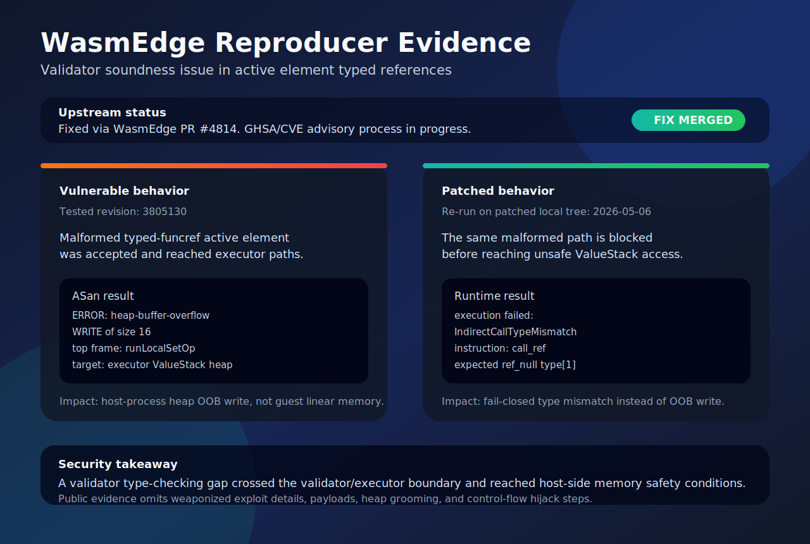
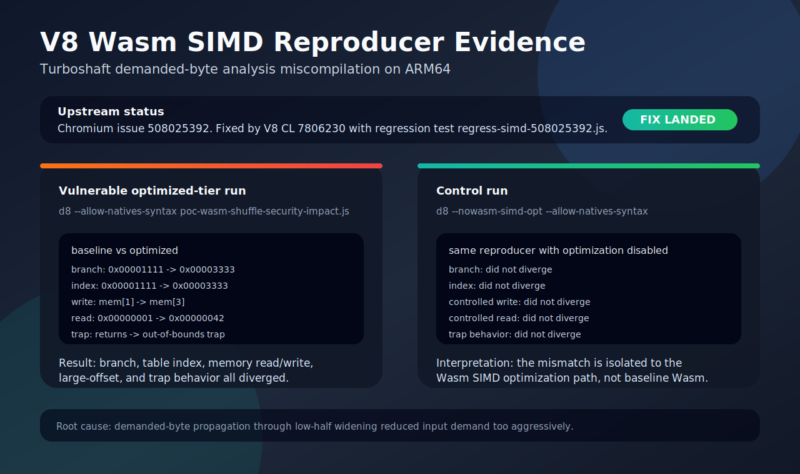

# KIKI | Security-minded Full-stack Developer

> WebAssembly runtime security, browser engine bug analysis, and full-stack product development.

[](https://webassembly.org/)
[](https://v8.dev/)
[](https://isocpp.org/)
[](https://react.dev/)
[](https://spring.io/projects/spring-boot)

Hello, I am **Jinwoo Han**, a developer focused on WebAssembly runtime security, browser engine bug hunting, compiler optimization bugs, and full-stack product development.

I find and report low-level bugs where small implementation assumptions become security or correctness impact: validator soundness gaps, runtime invariants, sanitizer findings, compiler semantic divergence, and upstream-ready vulnerability reports. I also build user-facing web products with React, TypeScript, Spring Boot, and cloud infrastructure.

## Currently

- Hyundai AutoEver Mobility SW School, 3rd cohort, in progress through June 2026
- Researching WebAssembly runtime and browser engine security
- **Open to opportunities**: security engineer and full-stack developer roles

## Highlights

- Discovered and responsibly reported a WasmEdge validator soundness vulnerability; upstream PR and regression tests were merged, and the GHSA/CVE process is in progress.
- Discovered a V8 Turboshaft Wasm SIMD miscompilation and reported it through Google VRP; the fix CL landed upstream, and reward review is in progress.
- Built PINT, a photo location and filter-sharing platform, focusing on masonry feed UX,
  infinite scrolling, SPA auth UX, and frontend state synchronization.

## Featured Work Summary

| Project | Summary |
| --- | --- |
| WasmEdge Validator Soundness Vulnerability | Discovered a typed function reference validation gap in WasmEdge, responsibly reported the issue, and demonstrated malformed Wasm module acceptance, runtime invariant breakage, and host-side heap OOB write. Upstream fix and regression tests were merged; GHSA/CVE process is in progress. |
| V8 Turboshaft Wasm SIMD Compiler Bug | Discovered an ARM64 optimized-tier miscompilation in V8 Turboshaft's Wasm SIMD optimizer and reported it through Google VRP. The upstream V8 fix CL landed with a regression test; reward review is in progress. |
| Leviathan Engine | Patent-pending security architecture that tracks sensitive bytes in WebAssembly linear memory and deterministically overwrites exact allocation ranges. |
| PINT | Photo location and filter-sharing platform. Frontend work included masonry feed behavior, interaction design, SPA auth UX, and team collaboration. |

## Visual Evidence

### WasmEdge Vulnerability Evidence

I discovered a validator soundness issue in WasmEdge involving active element segments with typed function references. On the vulnerable revision, my targeted malformed module passed validation and reached executor paths. Under ASan, it triggered a host-process `ValueStack` heap OOB write. On the patched tree, the same malformed path is blocked with `IndirectCallTypeMismatch`, showing fail-closed behavior.



- Upstream fix: [WasmEdge PR #4814](https://github.com/WasmEdge/WasmEdge/pull/4814)
- Status: upstream fix merged, GHSA/CVE advisory process in progress
- Key point: the observed memory-safety impact was in the executor's host-side `ValueStack`, not guest linear memory

### V8 Turboshaft Bug Evidence

I discovered an ARM64 miscompilation in V8 Turboshaft's Wasm SIMD shuffle reducer and reported it through Google VRP. The root cause was demanded-byte analysis underestimating required input bytes when demand propagated through a low-half widening operation.



- Chromium issue: [508025392](https://issues.chromium.org/issues/508025392)
- V8 fix CL: [7806230](https://chromium-review.googlesource.com/c/v8/v8/+/7806230)
- Merged commit: [`f56988e0207f8a4ce295b46ad4c50367140f899e`](https://chromium.googlesource.com/v8/v8/+/f56988e0207f8a4ce295b46ad4c50367140f899e)
- Full reproducer output: [v8-reproducer-output.md](./evidence/v8-reproducer-output.md)
- Google VRP status: reported by me, triaged as a valid security issue, reward decision in progress

<details>
<summary>Key V8 divergence signals</summary>

```text
branch baseline:   0x00001111
branch optimized:  0x00003333

index baseline:    0x00001111
index optimized:   0x00003333

write baseline:    mem[1] = 0xaa
write optimized:   mem[3] = 0xaa

read baseline:     0x00000001
read optimized:    0x00000042

trap baseline:     returns normally
trap optimized:    RuntimeError: memory access out of bounds
```

My control run with `--nowasm-simd-opt` does not diverge, isolating the issue to the Wasm SIMD optimization path.

</details>

### PINT Masonry Feed Evidence

**PINT** is a photo-first community platform for sharing where a photo was taken and how it was edited. The screenshot below shows a masonry feed built from real post preview data, including hover metadata, author/location/camera information, and like feedback UI.


- Frontend role: React 19, TypeScript, Vite, Zustand, Tailwind CSS, GSAP
- Contributions: Masonry-style feed, infinite scrolling, image preload and animation flow, feed card hover interactions, like micro-interactions, profile state synchronization
- Links: [Frontend](https://github.com/Team-Pint/Pint-Frontend), [Backend](https://github.com/Team-Pint/Pint-Backend), [Live Demo](https://pint-frontend-three.vercel.app/login)

## What I Care About

- Validation gaps that turn into memory-safety failures at runtime
- Whether compiler optimizations preserve source-level semantics
- Reporting security findings with reproducible evidence rather than overstated impact
- Connecting low-level analysis to user-facing product quality

## Technical Focus

```text
Security / Runtime
WebAssembly, WasmEdge, V8, Turboshaft, runtime validation, compiler correctness,
ASan, UBSan, malformed module construction, responsible disclosure

Frontend
React, TypeScript, Vite, Zustand, Tailwind CSS, GSAP, SPA authentication UX,
photo-first interaction design

Backend / Infra
Java, Spring Boot, Spring Security, PostgreSQL, Redis, AWS S3, EC2, Nginx,
Docker, Vercel, session and CSRF-based authentication
```

## Contact

- Email: [qwejinoohan@gmail.com](mailto:qwejinoohan@gmail.com)
- GitHub: [@harukiki97](https://github.com/harukiki97)
- LinkedIn: [Jinwoo Han](www.linkedin.com/in/jinwoo-han-980536408)
- Open to opportunities: security engineer and full-stack developer roles
- Main keywords: `WebAssembly`, `V8`, `WasmEdge`, `Runtime Security`, `Compiler Correctness`, `React`, `TypeScript`, `Spring Boot`
